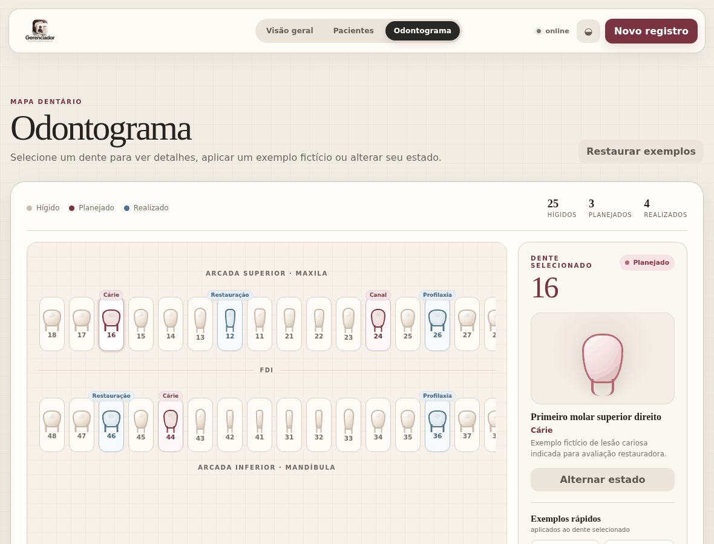
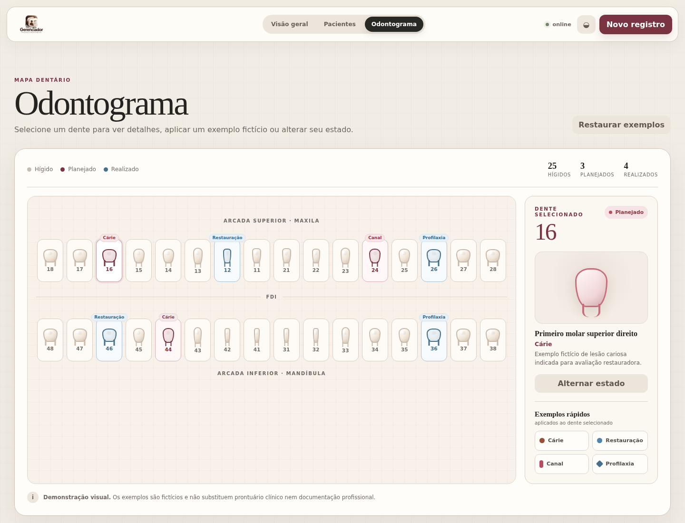
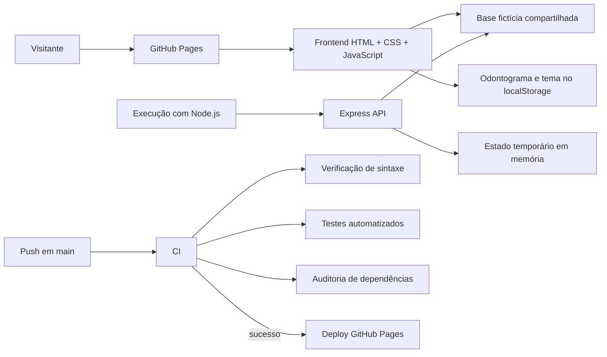

# Gerenciador de Pacientes Odontológicos

[](https://github.com/peedrovinicius/gerenciador-pacientes-odontologicos/actions/workflows/ci.yml)


Aplicação web para gestão demonstrativa de registros odontológicos fictícios, com API REST em Node.js e Express, odontograma FDI interativo, validação, testes automatizados, controles de segurança e CI/CD.

**Demo:** https://peedrovinicius.github.io/gerenciador-pacientes-odontologicos/  
**Versão estável:** [v1.1.0](https://github.com/peedrovinicius/gerenciador-pacientes-odontologicos/releases/tag/v1.1.0)

> Ambiente público de demonstração. Use somente dados fictícios.

## Visão rápida



<details>
<summary>Ver capturas estáticas</summary>




</details>

O GIF e as capturas podem ser atualizados manualmente pelos workflows dedicados do GitHub Actions.

## Destaques técnicos

- API REST com Node.js 24 e Express 4;
- odontograma adulto FDI com 32 elementos e estados clínicos demonstrativos;
- base compartilhada de pacientes fictícios entre frontend e backend;
- validação de entrada, contrato padronizado de erros e limite de payload;
- `Content-Security-Policy`, `Permissions-Policy` e outros cabeçalhos de segurança;
- testes automatizados da API e da lógica do odontograma;
- ESLint e auditoria automatizada de acessibilidade com Lighthouse;
- CI com verificação de sintaxe, lint, testes e auditoria de dependências;
- deploy do GitHub Pages condicionado ao sucesso do CI;
- interface responsiva com tema claro e escuro e navegação acessível por teclado.

## Proposta

O projeto concentra a experiência em três áreas:

1. **Visão geral** — indicadores e atividade recente;
2. **Pacientes** — consulta, busca, cadastro temporário e edição temporária;
3. **Odontograma** — representação FDI interativa com exemplos clínicos fictícios.

A demonstração pública foi desenhada para ser restaurável e previsível: inicia sempre com uma base controlada de pacientes fictícios, não persiste dados de pacientes inseridos por visitantes e impede exclusões que alterariam a experiência para outras pessoas.

## Funcionalidades

### Visão geral

- total de pacientes exibidos;
- quantidade de registros recentes;
- quantidade de tipos de procedimentos;
- lista de atividade recente;
- resumo visual dos procedimentos;
- indicador de disponibilidade da demonstração.

### Pacientes

- base fixa com 12 pacientes fictícios;
- busca por paciente ou procedimento;
- visualização de ficha demonstrativa;
- cadastro temporário;
- edição temporária;
- identificação visual de registros temporários;
- limite de 20 registros por sessão;
- exclusão desativada para preservar a base da demonstração;
- mensagens de sucesso e erro.

### Odontograma

- dentição adulta no sistema FDI;
- 32 elementos dentários;
- representação visual diferenciada para molares, pré-molares, caninos e incisivos;
- incisivos inferiores 31, 32, 41 e 42 representados com anatomia mais estreita;
- seleção de dentes por teclado ou ponteiro;
- nome acessível com número FDI, estado e condição;
- três estados demonstrativos: hígido, planejado e realizado;
- exemplos fictícios de cárie, restauração, canal e profilaxia;
- atalhos para aplicar exemplos ao dente selecionado;
- painel lateral com número, nome anatômico, condição e status;
- contadores por estado;
- restauração dos exemplos iniciais;
- persistência local apenas do odontograma.

## Arquitetura



O arquivo `public/demo-patients.js` é compartilhado pela interface estática e pelo backend para manter a mesma base inicial de 12 pacientes fictícios nos dois modos de execução.

## Modos de execução

### GitHub Pages

A demo principal é totalmente estática. A interface detecta o ambiente do GitHub Pages e ativa diretamente o modo demonstrativo, sem tentar chamar uma API inexistente. Ela inicia com os mesmos 12 pacientes fictícios e mantém novos cadastros ou edições somente na memória da página.

Ao recarregar ou reabrir:

- pacientes adicionados durante a sessão desaparecem;
- edições são desfeitas;
- a base fictícia original é restaurada.

Dados de pacientes não são gravados em `localStorage`. O armazenamento local é utilizado apenas para o odontograma e para a preferência de tema.

### Node.js + Express

Ao executar o projeto localmente, a interface utiliza a API Express. Cadastros e edições permanecem somente na memória do processo e são marcados como temporários.

O servidor aplica o mesmo teto de 20 registros da demo. A exclusão responde com `405 Method Not Allowed` e não altera a base.

## API

| Método | Rota | Comportamento |
| --- | --- | --- |
| `GET` | `/api/health` | Verifica disponibilidade da API |
| `GET` | `/api/pacientes` | Lista os registros da sessão |
| `POST` | `/api/pacientes` | Cria um registro temporário |
| `PUT` | `/api/pacientes/:id` | Edita um registro temporariamente |
| `DELETE` | `/api/pacientes/:id` | Bloqueado na demo; retorna `405` |

Exemplo:

```bash
curl -X POST http://localhost:3000/api/pacientes \
  -H "Content-Type: application/json" \
  -d '{"nome":"Maria Silva","procedimento":"Profilaxia"}'
```

Erros seguem um contrato único:

```json
{
  "codigo": "DADOS_INVALIDOS",
  "mensagem": "Nome e procedimento são obrigatórios.",
  "campos": ["procedimento"]
}
```

O campo `campos` aparece somente quando a resposta precisa indicar quais entradas exigem correção.

## Validação e segurança

O backend:

- exige `Content-Type: application/json` em criação e atualização;
- valida nome e procedimento;
- remove espaços extras;
- limita o tamanho dos campos;
- limita o corpo JSON a `10kb`;
- limita a demonstração a 20 registros por sessão;
- trata JSON inválido e payload excedido com respostas controladas;
- remove `X-Powered-By`;
- desabilita cache nas rotas `/api`;
- envia `X-Content-Type-Options`, `X-Frame-Options`, `Referrer-Policy` e `Permissions-Policy`;
- aplica `Content-Security-Policy`.

No frontend, dados dinâmicos são inseridos com APIs do DOM como `textContent`, sem interpolação direta em `innerHTML`.

## Decisões de projeto

**Dados fictícios e efêmeros.** A demo pública não foi concebida para armazenar dados clínicos reais. A base controlada e as alterações temporárias mantêm o ambiente restaurável e evitam persistência acidental de informações inseridas por visitantes.

**Exclusão bloqueada.** A rota `DELETE` existe no contrato da API, mas é bloqueada na demonstração para impedir que um visitante remova registros da base utilizada por outros usuários.

**Dois modos de execução.** GitHub Pages apresenta a experiência visual sem depender de servidor. A execução com Node.js disponibiliza a API Express e demonstra o comportamento HTTP do projeto.

**Estado local limitado.** `localStorage` é usado somente para preferências de interface e odontograma demonstrativo, nunca para pacientes.

**Escopo clínico controlado.** Agenda, financeiro, documentos, prescrições e prontuário clínico completo ficam fora deste repositório para preservar uma proposta concentrada e verificável.

## Tecnologias

| Área | Tecnologia |
| --- | --- |
| Frontend | HTML5, CSS3, JavaScript |
| Backend | Node.js 24, Express 4 |
| Testes | Node Test Runner |
| Qualidade | ESLint, Lighthouse |
| CI/CD | GitHub Actions |
| Demo | GitHub Pages |

## Executar localmente

```bash
git clone https://github.com/peedrovinicius/gerenciador-pacientes-odontologicos.git
cd gerenciador-pacientes-odontologicos
npm ci
npm start
```

Acesse `http://localhost:3000`.

Nenhuma variável de ambiente é obrigatória para a execução local.

Teste rápido da API:

```bash
curl http://localhost:3000/api/health
```

## Qualidade, testes e CI

```bash
npm run lint
npm test
```

A suíte cobre:

- validação de campos obrigatórios, tipos e limites;
- normalização de espaços;
- criação e atualização pela API;
- respostas `404`, `409`, `413`, `415` e bloqueio de `DELETE`;
- cabeçalhos de segurança, CSP e `Permissions-Policy`;
- base fixa de 12 pacientes;
- teto de 20 registros;
- estado inicial e persistência do odontograma;
- compatibilidade com formato legado do estado do odontograma;
- anatomia visual e nomenclatura FDI.

O workflow de CI executa `npm ci`, verificação de sintaxe, ESLint, testes automatizados, auditoria de acessibilidade com Lighthouse e `npm audit --omit=dev --audit-level=high`. O Lighthouse verifica visão geral, pacientes, odontograma e tema escuro, com pontuação mínima de 95 em cada estado. O deploy do GitHub Pages não possui atalho manual e é iniciado somente após a conclusão bem-sucedida do CI.

## Estrutura

```text
.
├── .github/
│   ├── ISSUE_TEMPLATE/
│   ├── workflows/
│   │   ├── ci.yml
│   │   ├── demo-gif.yml
│   │   ├── pages.yml
│   │   └── screenshots.yml
│   └── pull_request_template.md
├── docs/
│   ├── odontograma-demo.gif
│   └── screenshots/
├── public/
│   ├── app.js
│   ├── demo-patients.js
│   ├── favicon.svg
│   ├── gerenciador-logo-marrom.svg
│   ├── index.html
│   ├── odontogram-model.js
│   └── styles.css
├── src/
│   ├── app.js
│   ├── store.js
│   └── validation.js
├── tests/
│   ├── odontogram.test.js
│   └── server.test.js
├── CONTRIBUTING.md
├── eslint.config.js
├── package.json
├── package-lock.json
├── server.js
└── README.md
```

## Documentação como contrato

O README acompanha o comportamento real da aplicação. Funcionalidades adicionadas ou removidas devem ser refletidas neste arquivo na mesma alteração.
